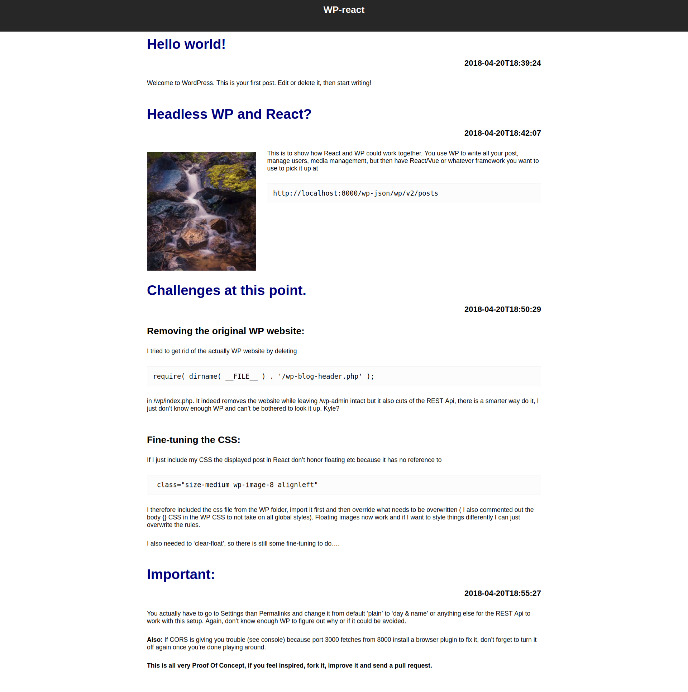

# wp-react

### A quickly thrown attempt to make react fetch posts from a WP -backend.

Super basic, if you feel like improving it, fork it, improve it, send me a pull request.

### Install docker compose

[https://docs.docker.com/compose/install/](https://docs.docker.com/compose/install/)

Then run `docker-compose up` in the folder with `docker-compose.yaml`, install wordpress, write a post or two

### Get the react-app started

`yarn install`

`yarn start`

It should just pick up the posts from you WP and display them.

